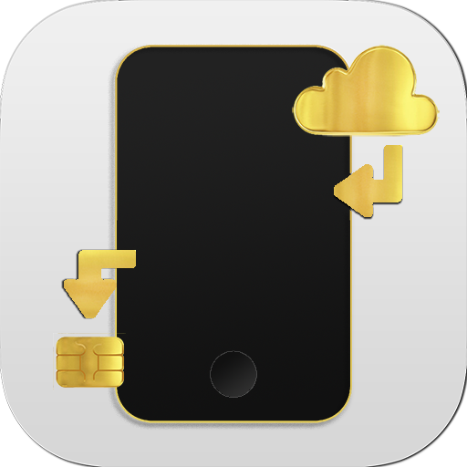

# CHEAP SMS Gateway


This app uses a REST API that communicates with your phone allowing it to become a SMS sender gateway server or a push notification point, so you can get status and informations from projects you developed.

<p><br></p><p><br></p>

# Usage

Make a GET or a POST call to the reffered link as it follows containing the parameters described on this documentation.

```

GET/POST  -> /rest?parameters... HTTP/1.1
          -> act=[sms OR push]
          -> token=[YOUR APP UNIQ TOKEN]
Host: https://cheapsms.slockz.com

```
<p><br></p>
<p>
If you wish to send a SMS using your phone, you can call the url like this:

```

https://cheapsms.slockz.com/rest?act=sms&to=[PHONE-NUMBER]&msg=[MESSAGE]&token=[YOUR-APP-UNIQ-TOKEN]

```

</p>
<p>
Or if you want to send yourself a push notification, you can pass these parameters:
  
```

https://cheapsms.slockz.com/rest?act=push&to=[YOUR-APP-UNIQ-TOKEN]&msg=[MESSAGE]

```

</p>
<p><br></p>
<p>
Although you can refresh your token on the APP, it's recommended that you don't provide your token publicly, in order to prevent spammimg.

<p><br></p>
<p>
        
# More usage

If you need to send a sms and guarantee that it's going to be sent as fast as possible, you can ask the API to fire it from multiple devices by passing more tokens on the "token" parameter delimited by "," as described below:
        
```

https://cheapsms.slockz.com/rest?act=sms&to=[PHONE-NUMBER]&msg=[MESSAGE]&token=[TOKEN-1,TOKEN-2,TOKEN-3]

```

Then, the first device that sees the message send request, will take the task and send it.
</p>
<p><br></p>
<p>
        
# EDIT

In case that the https certificate fails or the sub-domain collapses, the following address is always going be available:
        
```

http://slockz.com/lab/cheapsms/rest?...

```

</p>
<p><br></p>
<p>
        
Best regards,

Mayro Colnago.
